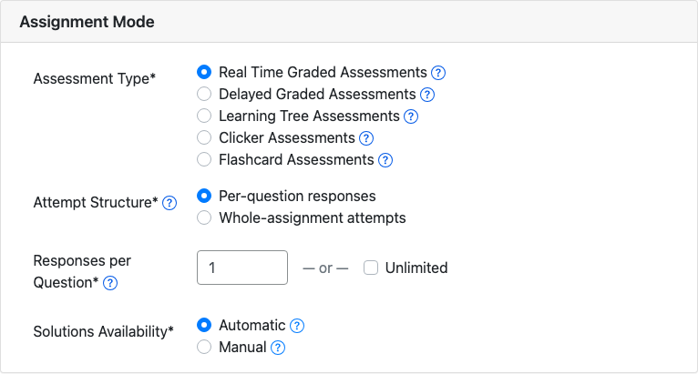
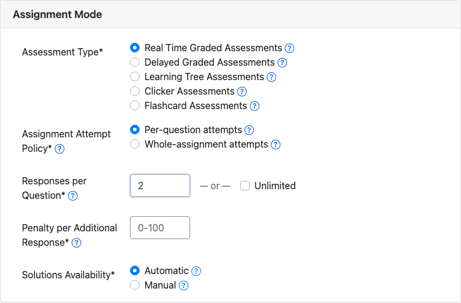
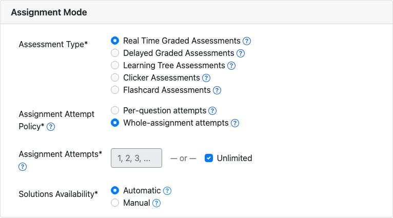
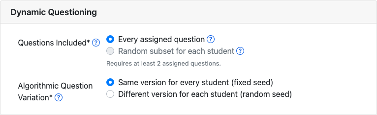
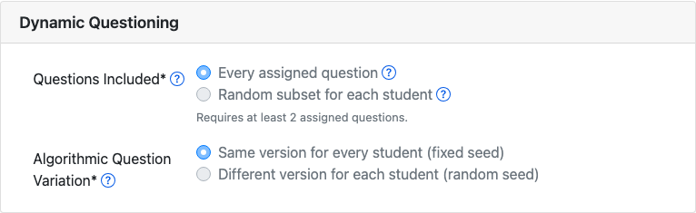
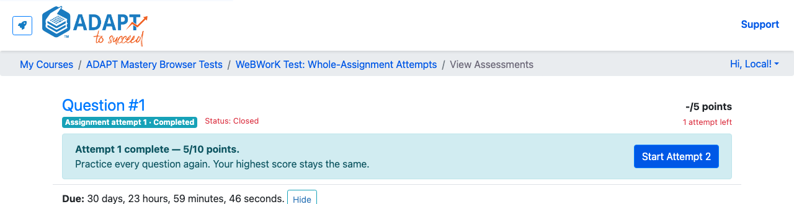
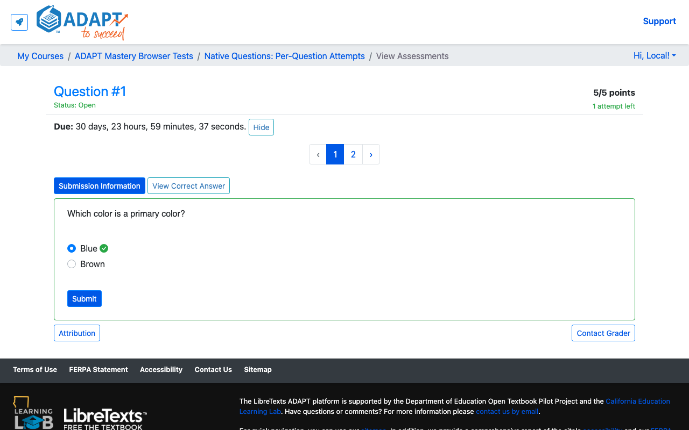
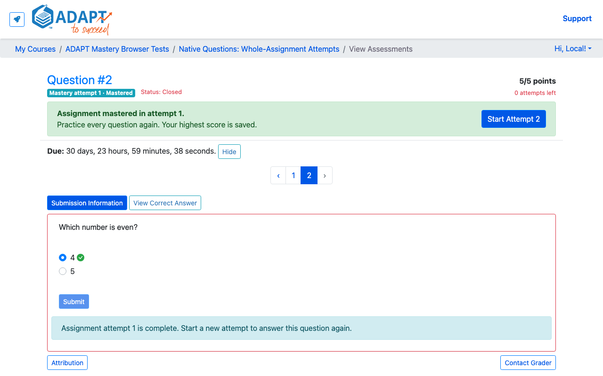
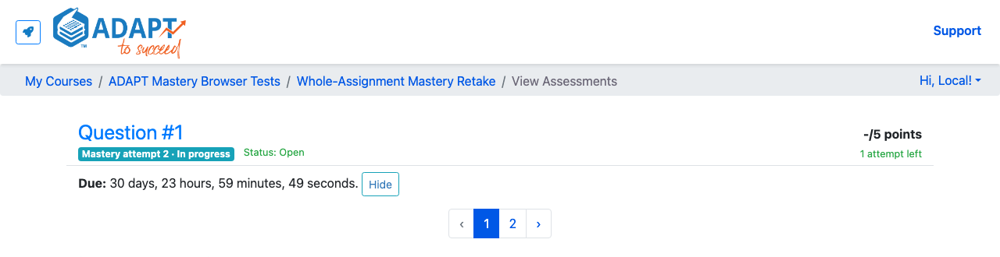

This repository provides local Podman orchestration and browser-based smoke tests for LibreTexts ADAPT development work.

# ADAPT Test Suite

The test suite is intentionally separate from the upstream ADAPT contribution. Local credentials,
container state, Playwright artifacts, and screenshots remain here.

## Screenshots

<!-- screenshots:begin (managed by screenshot-docs) -->









<!-- screenshots:end -->

## Run ADAPT from the mastery worktree

Copy and edit the local account configuration once:

```bash
cp podman-local.example.yml podman-local.yml
chmod 600 podman-local.yml
```

Startup, reset, account, and fixture commands fail before invoking Podman when this file is missing
or unreadable. Read-only and cleanup commands remain available without it.

Start the Podman environment from the sibling `LibreTexts-ADAPT` repository's
`mastery-retakes` branch:

```bash
./run_podman-worktree.sh
```

Rebuild the worktree image and relaunch the environment after source changes:

```bash
./run_podman-worktree.sh rebuild
```

The launcher automatically uses the branch's registered worktree when one exists, preserving
uncommitted changes. Otherwise, it builds the local or `origin/mastery-retakes` ref from the
regular ADAPT checkout. Set `ADAPT_REPOSITORY_DIR` only when that checkout is not in the default
sibling location, or set `ADAPT_WORKTREE_DIR` to override worktree discovery.

For future work, set one variable to select another branch and its worktree. The launcher derives
its image, container, network, and volume names from the same value:

```bash
ADAPT_WORKTREE_BRANCH=feature/example ./run_podman-worktree.sh
```

## Run the visual smoke test

Install the browser-test dependencies once:

```bash
npm install
npx playwright install chromium
```

With ADAPT running at `http://localhost:8081`, run:

```bash
./run_playwright_tests.sh
```

The test logs in with the instructor account from `podman-local.yml`, opens the unsaved New
Assignment form, checks the assignment-mode and dynamic-questioning controls, and refreshes the committed captures under
`docs/screenshots/`. It does not save an assignment or modify the ADAPT source tree. Failure traces
and incidental failure screenshots remain ignored under `test-results/`.
